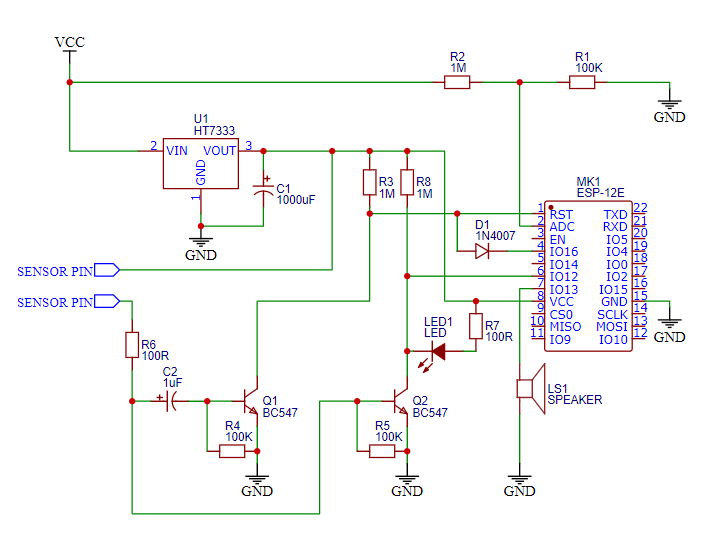
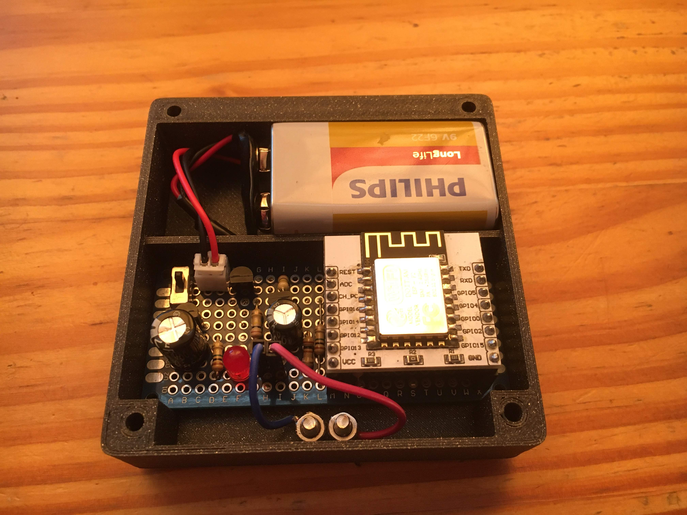
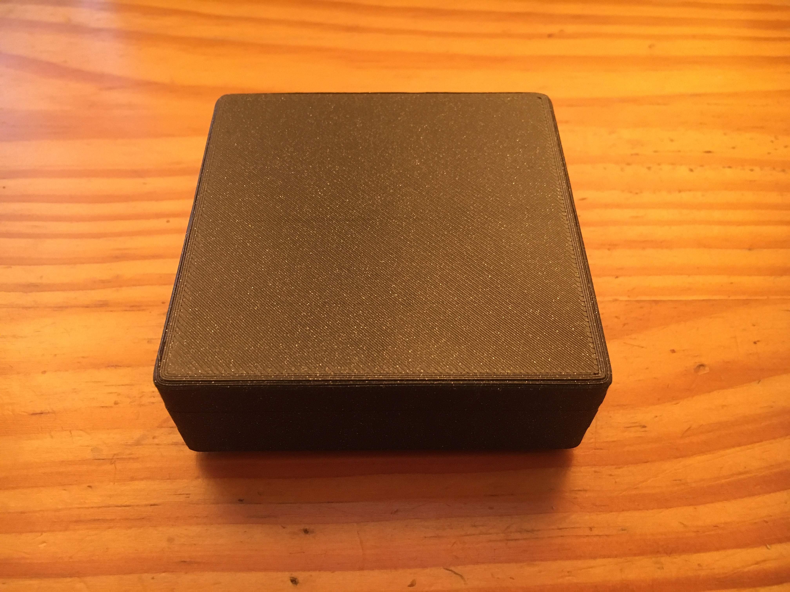

# Water Leak Sensor

This repository contains circuit diagram and code for low power water leak sensor using
ESP-8266 (ESP-12E).

## Description

Purpose of this project is to create an online sensor that detects water leak (e.g. in
bathroom or toilet) and sends a push notification immediately.

The sensor also observes its level of battery voltage at regular intervals and sends
notification in case the energy drops below a critical threshold. On every wake it
publishes the current battery voltage and leak state to an MQTT broker with
Home Assistant auto-discovery, so a "Water Leak Sensor (Bathroom)" device appears in
Home Assistant with no manual YAML.

## Circuit Diagram



The circuit was designed to run on a 3.7V Li-Ion battery, but it can accept any voltage between
3.5 - 12 volts. Just don't forget to adjust the `CRITICAL_VOLTAGE` in the
[sketch](./water_leak_sensor.ino) accordingly.

## Credentials and Configuration

This sketch uses a user-scoped Arduino library named `credentials` (installed at
`~/Documents/Arduino/libraries/credentials/credentials.h`) so the same credentials
header is shared across projects. Required macros:

```c
#ifndef STASSID
  #define STASSID   "..."
  #define STAPSK    "..."
#endif

#ifndef API_HOST
  #define API_HOST  "https://..."
  #define API_TOKEN "..."
  #define PHONE_NUM "..."
  #define EMAIL     "..."
#endif

#ifndef MQTT_SERVER
  #define MQTT_SERVER "homeassistant.local"
  #define MQTT_PORT   1883
  #define MQTT_USER   "..."   // optional; omit the #define to connect anonymously
  #define MQTT_PASS   "..."
#endif
```

The `PLACE` macro (e.g. `"bathroom"`, `"toilet"`) is defined at the top of
`water_leak_sensor.ino` — change it per-unit. It appears in the email subject, the MQTT
topic path, and the Home Assistant device name.

## MQTT Topics

With `PLACE = "bathroom"`:

| Topic                                     | Retained | Payload          |
|-------------------------------------------|----------|------------------|
| `water_leak_sensor/bathroom/battery`      | yes      | voltage in V     |
| `water_leak_sensor/bathroom/leak`         | yes      | `ON` / `OFF`     |
| `water_leak_sensor/bathroom/available`    | yes      | `online` / `offline` (LWT) |

Home Assistant auto-discovery configs are published to
`homeassistant/sensor/water_leak_<chipid>/battery/config` and
`homeassistant/binary_sensor/water_leak_<chipid>/leak/config` on each wake.

## Compilation and Upload

The sketch targets the generic ESP8266 core. With `arduino-cli` on your PATH, use the
helper scripts in `scripts/`:

```bash
scripts/upload.sh            # upload + open serial monitor
scripts/upload.sh --compile  # compile first, then upload
scripts/monitor.sh           # just open the serial monitor
```

The first time you run either script it asks which serial port to use and remembers the
choice for the rest of the shell session (cached in `$WATER_LEAK_SENSOR_UPLOAD_PORT`).

Manual compile (equivalent to what the script runs):

```bash
arduino-cli compile --fqbn esp8266:esp8266:generic --libraries ~/Documents/Arduino/libraries .
```

IDE settings if you prefer Arduino IDE:
* Board: Generic ESP8266 Module
* Upload speed: 115200
* Flash size: 4M (1M SPIFFS)

## Adjustments To Minimize Power Consumption

I was able to lower the power consumption of ESP-8266 board by using the deep sleep mode. I
am using the maximum reliable deep sleep interval of 3 hours.

Current draw of the board and supplemental circuit in the deep sleep mode is about 30uA.
When the board awakes and is not connected to WiFi (i.e. is only checking the voltage), then
it draws around 70 mA for about 2 seconds.

## The Finished Product



