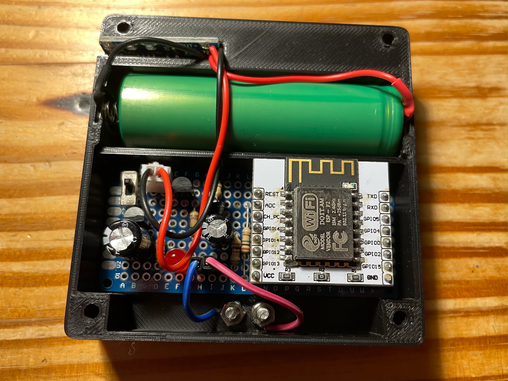

# Water Leak Sensor

This repository contains circuit diagram and code for low power water leak sensor using
ESP-8266 (ESP-12).

## Description

Purpose of this project is to create an online sensor that detects water leak (e.g. in 
bathroom or toilet) and sends a push notification immediately.

The sensor also observes its level of battery voltage at regular intervals and sends
notification in case the energy drops below a critical threshold.

## Circuit Diagram


The circuit was designed to run on a 9V battery, but it can accept any voltage between
3.5 - 12 volts. Just don't forget to adjust the `CRITICAL_VOLTAGE` in the
[sketch](./water_leak_sensor.ino) accordingly.

## Credentials and Configuration

This snippet uses a configuration file `config.h` that stores credentials and confidential
information used within the code.

To create the file, run the following script (replace `***` with the real values):

```bash
cat << EOF >> config.h
#ifndef CONFIG_H
#define CONFIG_H

#define WIFI_NAME "***"
#define WIFI_PSWD "***"

#define API_HOST  "https://***"
#define API_TOKEN "***"

#define PHONE_NUM "***"
#define EMAIL     "***"

#endif
EOF
```

## Compilation and Upload Configuration

* Board: Generic ESP8266 Module
* Upload speed: 115200
* Flash size: 4M (1M SPIFFS)

## Adjustments To Minimize Power Consumption

I was able to lower the power consumption of ESP-8266 board by using the deep sleep mode. I
am using the maximum reliable deep sleep interval of 3 hours.

Current draw of the board and supplemental circuit in the deep sleep mode is about 30uA.
When the board awakes and is not connected to WiFi (i.e. is only checking the voltage), then
it draws around 70 mA for about 2 seconds.

One standard 9V battery with a capacity of 500mAh should be in theory able to power the
circuit for more than a year.

## The Finished Product


